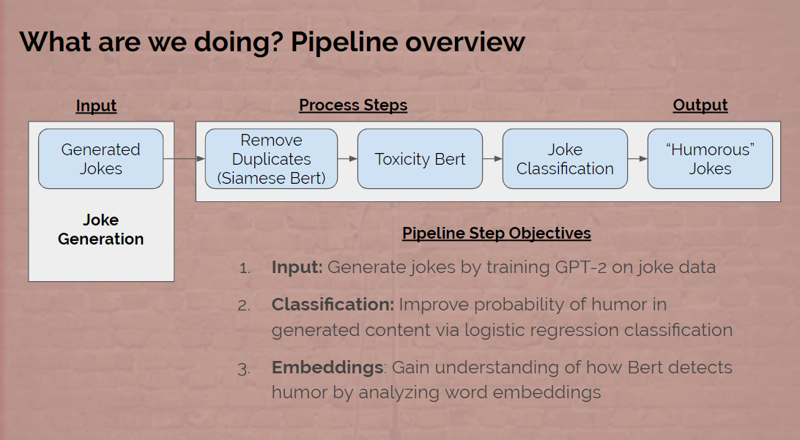
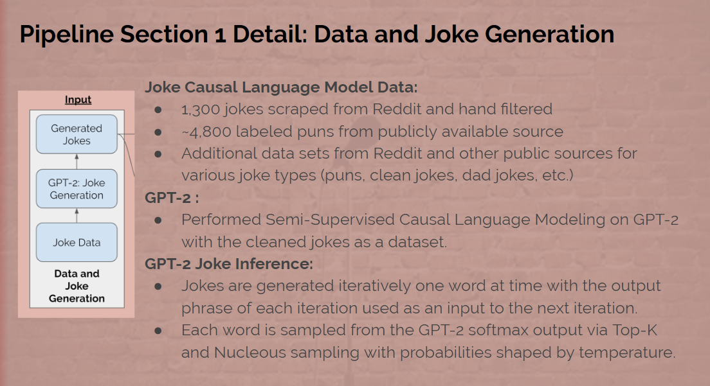
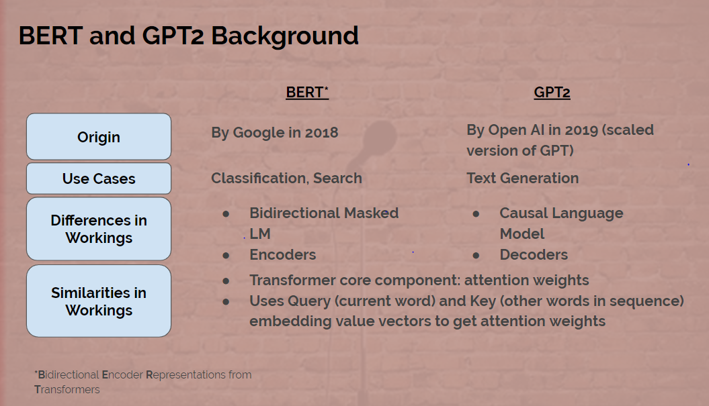
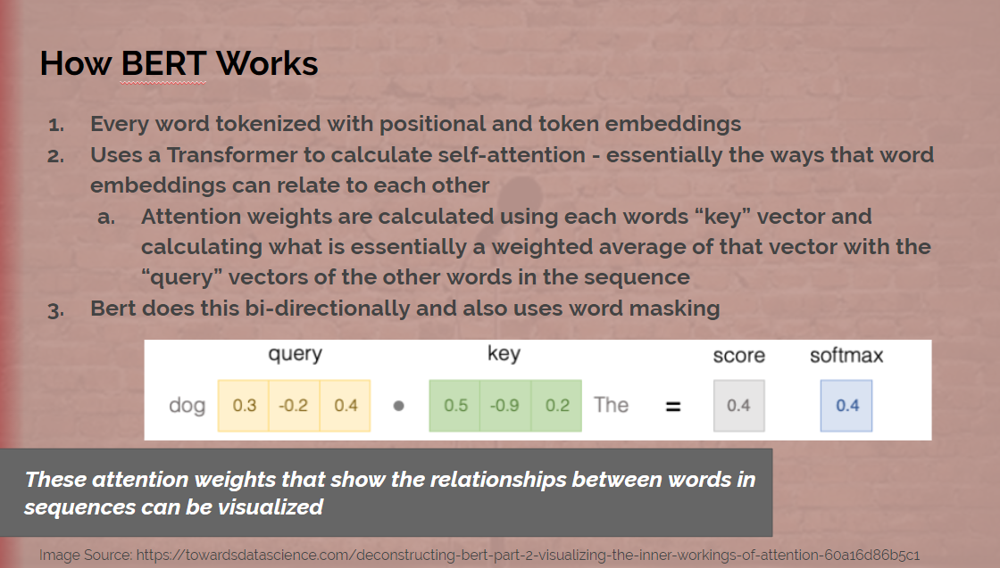
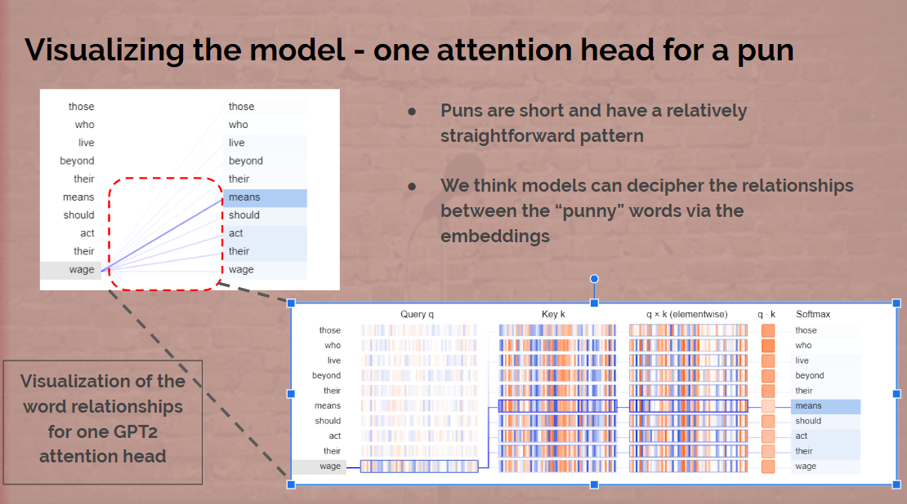

# MIDS UC Berkeley w210: Humorous Bot Study

## Introduction
Given the exponential rate of growth of user created data, it is important to consider ways to automatically detect specific information. Our team is interested in exploring and understanding how specifically humorous content can be detected and created using deep learning based means. Furthermore, our team has shifted focus on understanding the mechanisms of training encoders with humorous text.  The purpose of this project is to build model architecture for detecting humor and examining how encoders such as ALBERT learn humor.

## Objective
Determine how well Natural Language Processing (NLP) can understand humor by: 
1. generating jokes
2. classifying jokes and 
3. by analyzing how the models understand humor 

## Why Humor?
Humor is very contextual and often ambiguous in construction making it harder for a model to understand and predict. This makes it interesting for exploring the boundaries of NLP

## What's new?
Other papers have attempted to understand how well NLP can detect humor by predicting the humor of a joke, but we attempt to take it a step further by generating jokes and analyzing how humor is detected.

## Pipeline Overview

## BERT and GPT 2 Recap

In our project, we focus on two deep learning concepts called BERT and GPT2.  

## What Can Bert Tell Us About Humor?
Overall, there is no universally agreed upon theory of humor. 

Two leading theories:
*Benign Violation Theory*: a situation threatens the way that you believe the world “ought” to be but is benign.

*Incongruity Theory*: humour arises when things that do not normally go together replace logic and familiarity.
These theories seem to match how jokes are told (especially puns), but are likely too vague to build a quantitative description of humor

### Other Findings

* We filtered the r/jokes data set through BERT-MNLI (trained on Multi NLI) 
-- We found that for 98% of jokes the second half of the joke was neutral or contradictory and only 2% entailment
* Highest rated Reddit jokes - similar overall pattern but still very different:
-- Breaking news: Bill Gates has agreed to pay for Trump’s wall …On the condition he gets to install windows
-- My girlfriend told me to take the spider out instead of killing it. We went and had some drinks. Cool guy. Wants to be a web developer.	
* Puns seem to have a much more distinctive pattern of word play
-- they met in cooking class it was boil meets grill
-- the violinist spent the night in a vile inn

## GPT 2 Joke Generation Results

### Example of puns
* he must have been the most trustworthy of all bankers because he could tell you when he had made his money
* that was a bad breakup she said but i saw through it
* when the subject of computers is brought up people get excited and think of apps
* when the doorbell rang at the office for national statistics the person on the other end of the phone said it was a recording

### Example of jokes
* I'm a man of my word, but I'm not a good one at swearing.
* I got a new job as a dishwasher, so I don’t have time to cook anymore.
* Just heard that a rock concert went off without a hitch... I wonder if the band has any injuries?

## Joke Classification Model Results 

Our main metric of choice is the F1 score in effort to mitigate a balance between Type I and II errors.  Thie results reveal that the model is able to classify text patterns of what is considered to be humorous jokes and puns vs. jokes and puns not considered to be funny.

Category | Our Model F1 Score | Previous Paper F1 Score | Human
--- | --- | --- | ---
Puns | 0.934 |0.931 | N/A
Full Reddit Joke Dataset | 0.693 |0.724 | 0.663

The impressive F1 score gives us confidence that BERT is able to deconstruct humor and classify it well according to some social threshold (in our case we consided jokes with over 200 upvotes to be "humorour").  Where BERT struggles it appears is generating unique humor text.  

## CLoser insepction of results using BertViz

## Conclusion: NLP can detect the patterns of jokes and puns, but doesn’t actually “understand” humor* Achieved much better than random humor classification results using BERT
* Generated jokes kept joke pattern, but were not always funny
* Modified puns test seems to suggest that good classification results are due to identifying some underlying patterns with the puns rather than actually understanding the drivers of humor
* Results consistent with those found by Niven & Kao and others where BERT is finding some underlying spurious correlations rather than having a true understanding of humor

In short, our team were able to create a highly performant joke classifier with BERT and were able to identify some of the structural patterns of specialied jokes and puns through the lens of BERT encodings.  This experiment has validated the difficulty in quantifying humor but we also celebrate our success in able to built upon previous work and identify patterns and trends for certain types of jokes. 

## Presentation Slides

The capstone slides are available at the following [link](https://docs.google.com/presentation/d/1BGM3b4JsK3tZTZTr8ENrGJCulL47lvL5IWv2oeyJutA/edit#slide=id.g8367136ab1_1_24).

## Code and Datasets

All code, models, and datasets are available in the [github page](https://github.com/jlee-snn/w210-capstone-humorbot)
